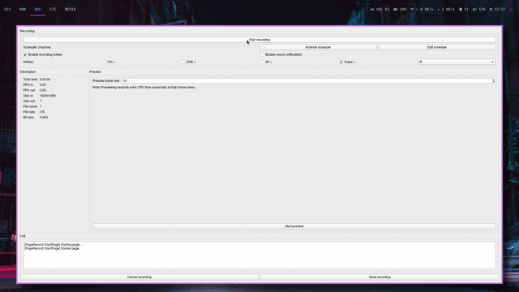

# EverythingGANs
In this project, I create several Generative Adversatial Network models for various Image to Image translation tasks. The models were first trained using tensorflow. Then, I use Flask to create a web-based implementation for uploading images and getting the augmented image.

## Motivation
After watching a video about CycleGAN on [Two Minute Papers](https://www.youtube.com/user/keeroyz) I was immediately fascinated with the idea of GANs. Mingled with a desire to improve my computer vision knowledge as well as my ability to read research papers and implement them, I decided to create this project.
Not only have I grown more comfortable in reading research papers(which at one time looked scary math jiggerish!), I have also had a lot of fun with this project.All in all this project served as way to :
* Help me get comfortable with reading Research Papers
* Increase my Computer Vision knowledge
* Improve my tensorflow coding skills

## Demo

## Architectures used

* **Image Deraining** - Implemented Pix2Pix architecure ([Paper](https://arxiv.org/abs/1611.07004))
*  **Animate Me** - Trainined CycleGAN model ([Paper](https://arxiv.org/abs/1703.10593)) on the [selfie to anime dataset](https://drive.google.com/file/d/1xOWj1UVgp6NKMT3HbPhBbtq2A4EDkghF/view?usp=sharing) used in U-GAT-IT paper ([Github Repo](https://github.com/taki0112/UGATIT))
*  **Image Superresolution** - Used SRGAN architecture ([Paper](https://arxiv.org/abs/1609.04802)) and used the Div2k dataset in Tensorflow Datasets

--- 
> GANs are lovely, dark and deep,but I have no gpu to keep and a lot of epochs to run before I sleep.
> -
> -- Me frustated and tired of training GANs